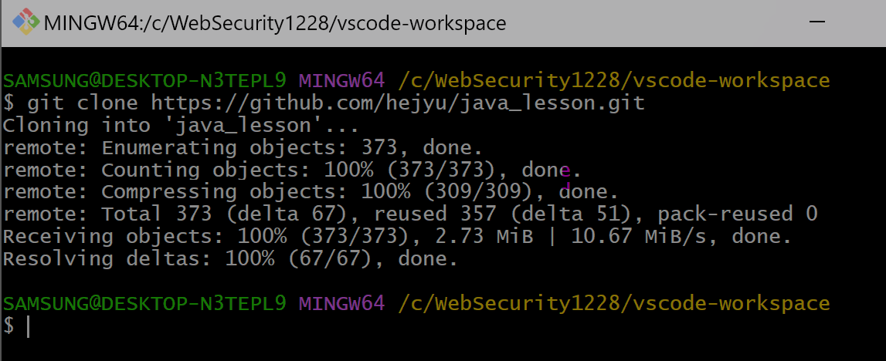
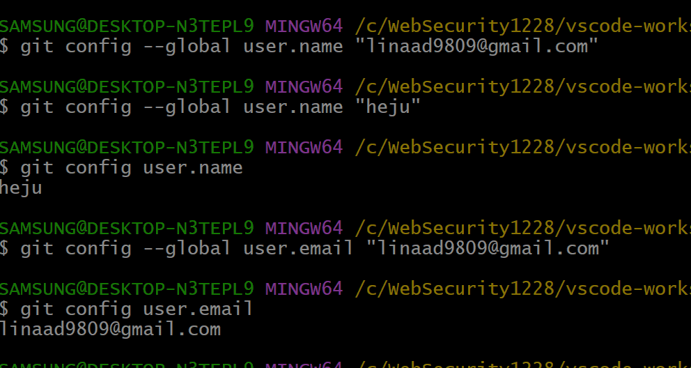

# git clone 뒤 버전 관리 시작
## 1. git clone
- 원격 저장소의 내용을 로컬에 복제하는 Git 명령어
- 원격 저장소의 모든 파일과 커밋 정보를 포함한 모든 정보를 가져온다

### 명령어
1. 작업 디렉토리(`작업트리`) > shift + 마우스 우클릭 > Open Git Bash Here 선택

1. `git clone https://github.com/{user name}/{repository name}.git` 입력

    

## 2. Git 버전 관리

Git은 파일을 버전을 등록하여 그 버전들 사이의 이동을 자유롭게 하는 `파일의 버전 관리 프로그램`이다

### 명령어
#### 1. 사용자 신원 정보 등록
>Git은 여러 사람이 협업하는 것을 전제로 하고 있기 때문에,
 저장소에 커밋 작업을 할 때 누구의 작업인지를 기록하는 것이 매우 중요하다.

1. 작업 디렉터리 > `shift + 마우스 우클릭` > `Open Git Bash Here` 선택

1. 이메일과 이름 설정

- **Github 저장소에 Push할 때  설정된 이메일을 사용하는 github 사용자와 자동으로 매칭된다** 

- 이메일 입력 : `git config --global user.email "linaad9809@gmail.com"`

- 이름 입력 : `git config --global user.name "heju"`

    

